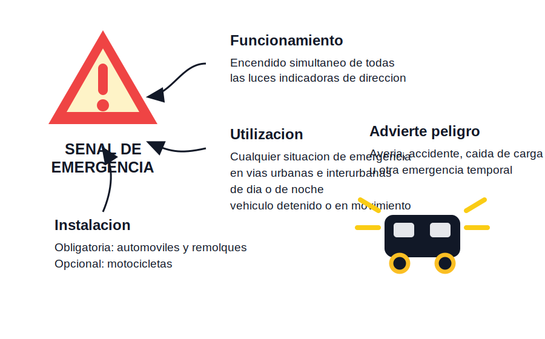

# Señal de emergencia

Tags: #permiso-b #alumbrado #señalizacion #emergencia #averia

## Regla

La luz o señal de emergencia se utiliza para señalizar y advertir el peligro que constituye temporalmente un vehículo afectado por:

- Avería.
- Accidente.
- Caída de la carga.
- Cualquier otra emergencia.

## Dónde y cuándo se utiliza

Debe utilizarse en <ins>vías urbanas e interurbanas</ins>, <ins>tanto de día como de noche</ins>.

Puede utilizarse tanto si el vehículo está <ins>inmovilizado</ins> como si está <ins>en movimiento</ins>.

## Funcionamiento

La señal de emergencia consiste en el funcionamiento simultáneo de todas las luces indicadoras de dirección.

## Instalación

La instalación de la señal de emergencia es:

- <ins>Obligatoria</ins> en automóviles y sus remolques.
- <ins>Opcional</ins> en motocicletas.

## En mis palabras

La señal de emergencia sirve para avisar a los demás usuarios de que el vehículo supone un peligro temporal. No depende de que sea de día o de noche, ni de que el vehículo esté parado: si hay emergencia, se usa.

## Idea clave para el examen

Se usa en <ins>vías urbanas e interurbanas</ins>, <ins>de día y de noche</ins>, con el vehículo detenido o en movimiento, para advertir una emergencia.

## Trampa habitual

Pensar que solo se usa cuando el vehículo está parado por avería. También puede utilizarse en movimiento si existe una emergencia, por ejemplo si no se puede alcanzar la velocidad mínima y hay peligro de alcance.

## Relacionado

- [[uso-obligatorio-del-alumbrado]]
- [[velocidad-moderada-segun-circunstancias]]
- [[vehiculos-inmovilizados-o-estacionados]]
- [[alumbrado]]

[uso-obligatorio-del-alumbrado]: uso-obligatorio-del-alumbrado.md "Uso obligatorio del alumbrado"
[velocidad-moderada-segun-circunstancias]: ../circulacion/velocidad-moderada-segun-circunstancias.md "Velocidad moderada según las circunstancias"
[vehiculos-inmovilizados-o-estacionados]: ../circulacion/vehiculos-inmovilizados-o-estacionados.md "Vehículos inmovilizados o estacionados"
[alumbrado]: index.md "Alumbrado y señalización luminosa"
