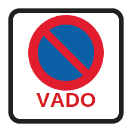

# Vado

Tags: #permiso-b #señales #estacionamiento #vado #prohibicion

## Regla

La señal de vado indica estacionamiento prohibido en el acceso señalado.

## En mis palabras

El vado protege una entrada o salida de vehículos. No se debe estacionar delante de un vado correctamente señalizado; forma parte de las [[prohibiciones-de-estacionamiento]] y puede convertirse en un caso de [[estacionamiento-perturba-gravemente-circulacion]].

## Idea clave para el examen

Vado = estacionamiento prohibido en ese acceso.

## Trampa habitual

Pensar que el vado es solo una advertencia. En el examen, recuerda que implica prohibición de estacionar.

## Relacionado

- [[estacionamiento-prohibido]]
- [[prohibiciones-de-estacionamiento]]
- [[estacionamiento-perturba-gravemente-circulacion]]
- [[zona-estacionamiento-limitado]]
- [[senales]]

## Fuente

- [Real Decreto 1428/2003, Reglamento General de Circulación, artículo 94](https://www.boe.es/buscar/act.php?id=BOE-A-2003-23514#a94): regula la prohibición de estacionar delante de vados señalizados correctamente.

[estacionamiento-prohibido]: estacionamiento-prohibido.md "Estacionamiento prohibido"
[prohibiciones-de-estacionamiento]: ../maniobras/prohibiciones-de-estacionamiento.md "Prohibiciones de estacionamiento"
[estacionamiento-perturba-gravemente-circulacion]: ../maniobras/estacionamiento-perturba-gravemente-circulacion.md "Estacionamiento que perturba gravemente la circulación"
[zona-estacionamiento-limitado]: zona-estacionamiento-limitado.md "Zona de estacionamiento limitado"
[senales]: index.md "Señales"
