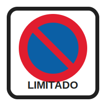

# Zona de estacionamiento limitado

Tags: #permiso-b #señales #estacionamiento #zona-limitada

## Regla

La señal indica una zona de estacionamiento de duración limitada y la obligación del conductor de indicar, de forma reglamentaria, <ins>la hora de comienzo del estacionamiento</ins>.

## Información que puede incluir

La señal puede incluir:

- El tiempo máximo autorizado de estacionamiento.
- El horario de vigencia de la limitación.
- Si el estacionamiento está sujeto a pago.

## En mis palabras

Se puede estacionar, pero no libremente: hay límite de tiempo y puede haber obligación de indicar la hora de inicio o pagar. Si no se coloca el distintivo autorizado o se supera el tiempo máximo, entra en las [[prohibiciones-de-estacionamiento]]. Si el estacionamiento bloquea o molesta gravemente al tráfico, conecta con [[estacionamiento-perturba-gravemente-circulacion]].

## Idea clave para el examen

Zona de estacionamiento limitado = <ins>indicar hora de comienzo</ins> y respetar tiempo, horario y posible pago si la señal lo establece.

## Trampa habitual

Confundirla con [[estacionamiento-prohibido]]. En la zona limitada se permite estacionar si se cumplen las condiciones.

## Relacionado

- [[estacionamiento-prohibido]]
- [[prohibiciones-de-estacionamiento]]
- [[estacionamiento-perturba-gravemente-circulacion]]
- [[vado]]
- [[senales]]

## Fuente

- [Real Decreto 1428/2003, Reglamento General de Circulación, artículo 94](https://www.boe.es/buscar/act.php?id=BOE-A-2003-23514#a94): regula las prohibiciones de estacionamiento y las zonas de estacionamiento con limitación horaria.

[estacionamiento-prohibido]: estacionamiento-prohibido.md "Estacionamiento prohibido"
[prohibiciones-de-estacionamiento]: ../maniobras/prohibiciones-de-estacionamiento.md "Prohibiciones de estacionamiento"
[estacionamiento-perturba-gravemente-circulacion]: ../maniobras/estacionamiento-perturba-gravemente-circulacion.md "Estacionamiento que perturba gravemente la circulación"
[vado]: vado.md "Vado"
[senales]: index.md "Señales"
